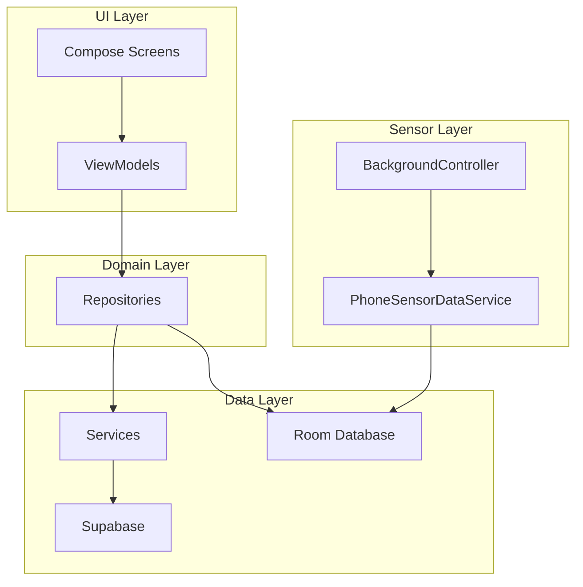
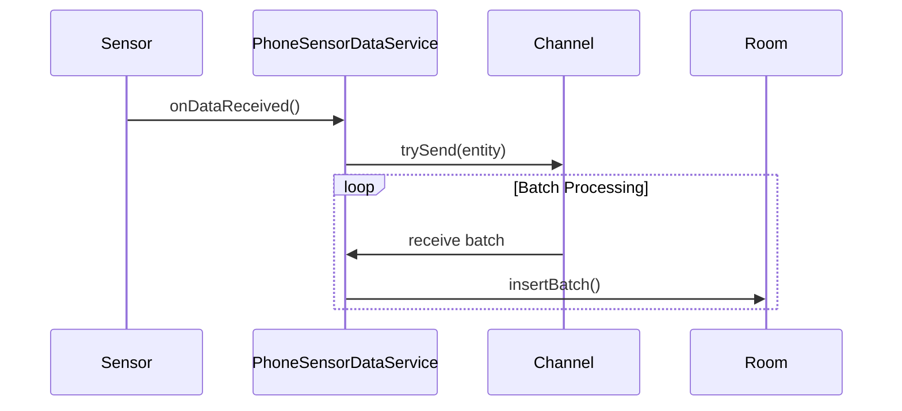
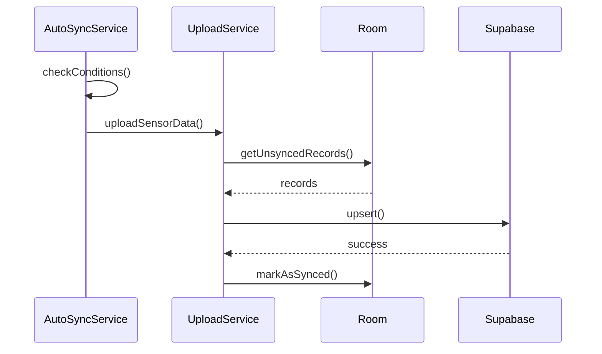

# App-Mobile-Tracker

Android application for mobile sensor data collection, storage, and synchronization.

# Required Configuration
Please make sure you [downloaded the Samsung Health SDKs](https://github.com/Kaist-ICLab/EnPULSE/blob/main/README.md#download-samsung-health-sensordata-sdk).

## Connecting the app with Supabase backend
Supabase annonymous keys and server address are used to join campaign and send data. In `local.properties`, set these 2 variables.

```
sdk.dir=C\:\\Your\\Android\\SDK\\directory
#Supabase key should go in here
SUPABASE_ANON_KEY=your_annoymous_key
SUPABASE_URL=your_self_hosted_supabase_server_address
```
* `SUPABASE_ANON_KEY`: The annonymous key can be found in the .env file in your supabase folder.
* `SUPABASE_URL`: The url is the same address that you access the supabase dashboard. Without manual setting, it uses port 8000.

# Architecture Overview
The application follows a clean architecture pattern with clear separation of concerns:



## Key Components

| Layer            | Description                                    |
|------------------|------------------------------------------------|
| **UI**           | Jetpack Compose screens with Material 3 design |
| **ViewModels**   | State management using Kotlin StateFlow        |
| **Repositories** | Data abstraction layer with Result pattern     |
| **Services**     | Background processing, sync, and upload        |
| **Database**     | Room database with 22+ entities                |
| **DI**           | Koin-based dependency injection                |

## Package Structure

```
kaist.iclab.mobiletracker/
├── config/           # App configuration (AppConfig, Constants)
├── db/               # Room database, DAOs, entities
│   ├── dao/          # Data Access Objects
│   └── entity/       # Database entities
├── di/               # Koin dependency injection modules
├── helpers/          # Utility helpers (Language, Supabase)
├── repository/       # Repository interfaces and implementations
│   └── handlers/     # Sensor-specific data handlers
├── services/         # Background services
│   └── upload/       # Upload services and handlers
├── ui/               # Compose UI
│   ├── components/   # Reusable UI components
│   └── screens/      # App screens
├── utils/            # Utility classes
└── viewmodel/        # ViewModels
```

## Data Flow

### Sensor Data Collection



### Data Synchronization



## Handler Pattern

Sensor data operations are abstracted using the Handler pattern:

```kotlin
interface SensorDataHandler {
    val sensorId: String
    val displayName: String
    suspend fun getRecordCount(): Int
    suspend fun getRecordsPaginated(...): List<SensorRecord>
    suspend fun deleteAll()
}
```

Each sensor type has its own handler implementation registered in `SensorDataHandlerRegistry`.

## Services

| Service                    | Purpose                                                   |
|----------------------------|-----------------------------------------------------------|
| `PhoneSensorDataService`   | Foreground service for receiving and batching sensor data |
| `AutoSyncService`          | Background service for automatic data synchronization     |
| `PhoneSensorUploadService` | Handles uploading phone sensor data to Supabase           |
| `WatchSensorUploadService` | Handles uploading watch sensor data to Supabase           |

## Database Schema

The app uses Room database with schema export enabled. Schema files are located in:

```
app-mobile-tracker/schemas/
```

## Related Modules

- [`tracker-library`](../tracker-library/README.md) - Core sensor tracking library
- [`app-wearable-tracker`](../app-wearable-tracker/README.md) - Watch companion app
